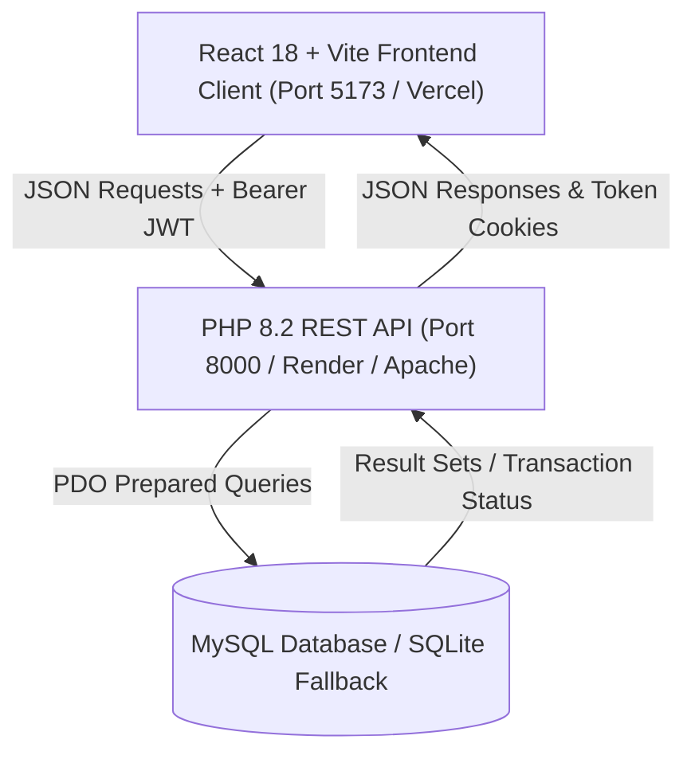

# ✈️ SkyHigh Air: Enterprise Airline Reservation & Fleet Management System

[](https://react.dev)
[](https://vitejs.dev)
[](https://www.php.net)
[](https://www.mysql.com)
[](https://jwt.io)
[](https://vercel.com)
[](https://render.com)

> **🎓 Academic Major Project Submission**  
> **Course:** Bachelor of Computer Applications / B.Tech / B.E. (Computer Science & Engineering / IT)  
> **Project Title:** SkyHigh Air — Online Airline Reservation & Passenger Fleet Management System  

---

## 👥 Project Team Members

| No. | Member Name | Role & Core Responsibilities |
|:---:|:---|:---|
| **1** | **Sahil** | **Frontend Lead & UI/UX Architect** (React 18, Interactive 3-3 Airbus Seat Map, Dynamic Responsive Layouts, Aviation Design System) |
| **2** | **Darshan** | **Backend Lead & Database Architect** (PHP 8.2 RESTful API, MySQL Relational Database Schema, PDO Transactions, Fleet Scheduling) |
| **3** | **Krish** | **Full-Stack Integrator & Security/Deployment Lead** (JWT Auth, Passenger Biometric Photo Upload, Web Check-in QR Codes, Vercel & Render Deployment) |

---

## 📋 Table of Contents
1. [Project Overview](#-1-project-overview)
2. [Key System Features](#-2-key-system-features)
3. [Technology Stack](#-3-technology-stack)
4. [System Architecture](#-4-system-architecture)
5. [Database Schema & Data Dictionary](#-5-database-schema--data-dictionary)
6. [Local Installation & Quick Setup](#-6-local-installation--quick-setup)
7. [GitHub Repository Setup Guide](#-7-github-repository-setup-guide)
8. [Cloud Deployment Guide (Vercel & Render)](#-8-cloud-deployment-guide-vercel--render)
9. [College Documentation & Viva Preparation](#-9-college-documentation--viva-preparation)

---

## 🌐 1. Project Overview

**SkyHigh Air** is an enterprise-grade digital aviation platform designed to handle end-to-end commercial airline operations. The system bridges the gap between passengers, counter ground staff, and flight dispatch operations through a unified high-performance architecture.

### Problem Solved:
Legacy airline reservation platforms often suffer from slow server-side rendering, convoluted seat selection, and poor mobile experiences. SkyHigh Air solves this with:
- **Instant Client-Side Navigation** using React 18 & Vite.
- **Interactive Aircraft Cabin Layout** matching Airbus A320 / Boeing 737 aircraft configurations.
- **Secure REST API Backend** built with lightweight, fast PHP 8.2 and MySQL.
- **Digital Web Check-in & Biometric Boarding Passes** with scannable dynamic QR codes.

---

## 🚀 2. Key System Features

### 1. Passenger Portal
- **Flight Discovery Engine:** Multi-criteria search by origin, destination, departure date, and price filter.
- **Biometric Photo & Profile Management:** Passengers can upload/update high-resolution profile headshots during registration or from their dashboard.
- **Interactive 3-3 Seat Map:** Visual seat selection with real-time state management (Available, Booked, Selected, Window, Aisle).
- **Instant Reservation & Payment:** Multi-passenger booking with integrated baggage, meal choices, and welcome loyalty bonus miles.
- **Self-Service Web Check-In:** 24/7 check-in via PNR code to issue official electronic boarding passes.
- **Scannable QR Boarding Pass:** Generates printable boarding passes complete with flight data, passenger photo, terminal, gate, and IATA-compliant QR code.

### 2. Airport Counter POS Desk
- **Walk-in Ticketing:** Dedicated interface for airport ground staff to issue immediate tickets for offline passengers.
- **Passenger Manifest Lookup:** Search bookings by PNR or passenger name in real time.

### 3. Administrator Operations Portal
- **Fleet Scheduling CRUD:** Add, update, reschedule, or cancel flights across national routes.
- **Real-time Business Analytics:** Revenue tracking, flight occupancy KPIs, popular flight corridors, and fleet market share.

---

## 💻 3. Technology Stack

| Layer | Technologies Used |
|:---|:---|
| **Frontend UI** | React 18.2, Vite 5.4, React Router DOM v6, Lucide React Icons |
| **Styling & Assets** | Modern Aviation CSS Design System (Glassmorphism, Dark Accents, HSL Color Tokens) |
| **Interactive UX** | Canvas-Confetti, QRCode.SVG, HTML5 Canvas Image Optimizer |
| **Backend API** | PHP 8.2 Object-Oriented REST API, PDO (PHP Data Objects) |
| **Security** | JWT (JSON Web Tokens) with HMAC-SHA256, Bcrypt Password Hashing |
| **Database** | MySQL 8.0 / MariaDB (via XAMPP) + SQLite Zero-Config Fallback |
| **Deployment** | Vercel (Frontend), Render / Railway / Apache (Backend & Database) |

---

## 🏛️ 4. System Architecture



---

## 🗄️ 5. Database Schema & Data Dictionary

The relational database `airline_reservation` consists of 5 interconnected tables:

1. **`users`**: Passenger, Agent, and Administrator credentials, reward miles, and `profile_pic` (LONGTEXT).
2. **`flights`**: Flight schedules, origin/destination hubs, departure/arrival timestamps, pricing, and booked seat matrices.
3. **`bookings`**: Confirmed flight reservations, PNR tracking codes, passenger lists (JSON), seat allocations, and boarding status.
4. **`airport_bookings`**: POS tickets issued at airport counter desks for offline walk-in travelers.
5. **`payments`**: Payment transaction logs, simulated gateways, and verification timestamps.

---

## ⚙️ 6. Local Installation & Quick Setup

### Prerequisites
- [Node.js](https://nodejs.org/) (v18 or v20+)
- [XAMPP](https://www.apachefriends.org/) (with Apache & MySQL) **OR** Standalone PHP 8.2+

### 1-Click Launch (Recommended for Windows)
Simply double-click the **`START_PROJECT.bat`** file in the root directory. It will:
1. Verify PHP and Node environments.
2. Initialize database tables and seed sample flights.
3. Start the PHP REST API on `http://127.0.0.1:8000`.
4. Launch the React frontend on `http://localhost:5173`.

### Manual CLI Setup:
```bash
# 1. Install frontend dependencies
cd react-client
npm install
cd ..

# 2. Setup Database in MySQL
npm run setup:php

# 3. Start PHP Backend Server (Terminal 1)
npm run php

# 4. Start React Frontend Dev Server (Terminal 2)
npm run react
```

---

## 🐙 7. GitHub Repository Setup Guide

To push this project to your GitHub account:

```bash
# 1. Initialize git in the root folder
git init

# 2. Add all files
git add .

# 3. Create initial commit
git commit -m "Initial Release: SkyHigh Air Airline Reservation System"

# 4. Rename main branch
git branch -M main

# 5. Link your GitHub remote repository (replace with your repo URL)
git remote add origin https://github.com/YOUR_USERNAME/airline-reservation-system.git

# 6. Push code to GitHub
git push -u origin main
```

---

## ☁️ 8. Cloud Deployment Guide (Vercel & Render)

### A. Deploy Frontend on Vercel
1. Sign in to [Vercel](https://vercel.com) and click **"Add New Project"**.
2. Import your GitHub repository.
3. In **Root Directory**, select `react-client`.
4. In **Build Command**, enter: `npm run build`.
5. In **Output Directory**, enter: `dist`.
6. Click **Deploy**. Your frontend is now live globally with free SSL!

### B. Deploy Backend on Render
1. Sign in to [Render](https://render.com) and click **"New +"** -> **Web Service**.
2. Connect your GitHub repository.
3. Set **Root Directory** to `php-backend`.
4. Set **Environment** to `PHP`.
5. Set **Build Command** to empty (or `composer install` if using packages).
6. Set **Start Command** to: `php -S 0.0.0.0:$PORT index.php`.
7. Click **Create Web Service**.
8. Once deployed, copy your Render API URL and update `react-client/src/services/api.js` (or use Vercel environment variables).

---

## 📚 9. College Documentation & Viva Preparation

Comprehensive documentation prepared for university submission:

- 📄 **Full 60-Page Academic Report:** [`docs/MAJOR_PROJECT_REPORT_60_PAGES.md`](file:///c:/Air/Airline%20Reservation%20System/docs/MAJOR_PROJECT_REPORT_60_PAGES.md)  
  *(Includes Certificates, Acknowledgements, SRS, DFD Levels 0-2, UML Class/Sequence/Use-Case Diagrams, ER Diagrams, 20+ Test Cases, Source Code listings, and References)*.
- 🖨️ **Printable PDF Generator (1-Click Print):** [`docs/PRINT_PROJECT_REPORT.html`](file:///c:/Air/Airline%20Reservation%20System/docs/PRINT_PROJECT_REPORT.html)  
  *(Open this HTML file in Google Chrome or Microsoft Edge and press `Ctrl + P` to save as a 60-page PDF ready for hard binding).*
- 🎤 **Project Presentation & Viva Explanation Guide:** [`docs/PROJECT_VIVA_EXPLANATION_GUIDE.md`](file:///c:/Air/Airline%20Reservation%20System/docs/PROJECT_VIVA_EXPLANATION_GUIDE.md)  
  *(Contains exact speaking roles for Sahil, Darshan, and Krish, live demo script, and 25+ viva questions with answers).*

---

### 🛡️ License & Copyright
Developed for academic assessment by **Sahil, Darshan, and Krish**. Open-source under the MIT License.
