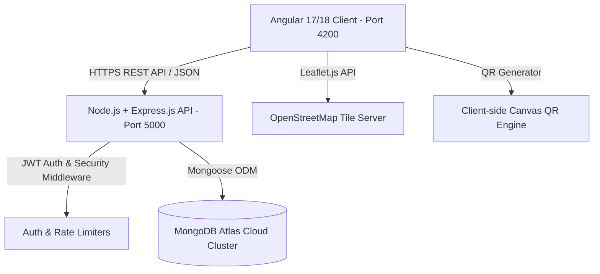

# SKYHIGH AIR: ENTERPRISE AIRLINE RESERVATION & FLEET MANAGEMENT SYSTEM
## Academic Major Project Report & Software Verification Dossier
**Academic Year:** 2026 – 2027  
**Degree:** Bachelor of Technology / Bachelor of Engineering / MCA / MSc (IT)  
**Project Category:** Major Project (Full-Stack Enterprise Web Application)  

---

### 👥 PROJECT TEAM & GROUP DETAILS (3 MEMBERS)
| Member # | Student Name | Enrollment / Roll No. | Project Role |
| :---: | :--- | :--- | :--- |
| **01** | [Student Name 1] *(Team Lead)* | [Enrollment No 1] | Frontend Architecture, Angular UI & Map Integration |
| **02** | [Student Name 2] | [Enrollment No 2] | Backend REST API, Controllers & Security |
| **03** | [Student Name 3] | [Enrollment No 3] | Database Design (MongoDB Atlas) & Testing |

**Project Guide / Mentor:** Prof. [Guide Name]  
**Department:** Department of Computer Engineering / Information Technology  
**Institution:** [College / University Name]  

---

## 📋 TABLE OF CONTENTS
1. [Executive Summary & Abstract](#1-executive-summary--abstract)
2. [Project Scope & Problem Statement](#2-project-scope--problem-statement)
3. [Software Requirement Specification (SRS)](#3-software-requirement-specification-srs)
4. [Technology Stack & System Architecture](#4-technology-stack--system-architecture)
5. [Database Design & Data Dictionary](#5-database-design--data-dictionary)
6. [Data Flow Diagrams (DFD) & Use Case Models](#6-data-flow-diagrams-dfd--use-case-models)
7. [Detailed Feature & Module Description](#7-detailed-feature--module-description)
8. [Security & Verification Report](#8-security--verification-report)
9. [Step-by-Step Live Demonstration Guide (For Viva)](#9-step-by-step-live-demonstration-guide-for-viva)
10. [Top 15 College Viva Voce Questions & Model Answers](#10-top-15-college-viva-voce-questions--model-answers)
11. [Conclusion & Future Enhancements](#11-conclusion--future-enhancements)

---

## 1. EXECUTIVE SUMMARY & ABSTRACT
The **SkyHigh Air Enterprise Reservation System** is a next-generation commercial airline passenger booking, check-in, and fleet intelligence platform engineered to simulate real-world aviation workflows adhering to International Air Transport Association (IATA) and Directorate General of Civil Aviation (DGCA) norms.

Traditional legacy reservation systems suffer from static flight scheduling, rigid single-tier seating models, lack of real-time geospatial route tracking, and disjointed airport ground counter management. This project resolves these bottlenecks by delivering an end-to-end cloud-native solution utilizing the **MEAN Stack (MongoDB Atlas, Express.js, Angular 17/18 Standalone, Node.js)**.

Key breakthroughs demonstrated in this project:
1. **Dynamic 1-Minute Live Flight Schedule Generation:** Background automation that updates flight routes, departures, and statuses continuously.
2. **Interactive 4-State Seat Concurrency Matrix:** Precision seat picker categorizing seats into Available (⬜), Booked (🟥), Held/Reserved (🟨), and Extra-Legroom Premium (🟦).
3. **Geospatial Route Visualization:** Real-time interactive vector globe and India/International map leveraging Leaflet.js with dynamic flight paths and airport popups.
4. **Integrated Airport Counter Desk:** Dual-mode portal allowing airport counter ticketing agents to book tickets on spot and issue immediate PNRs.
5. **Complete Web Check-in & Dynamic Boarding Pass:** Generates authentic boarding passes with scannable QR payloads, live departure status indicators, and flight tracking bars.
6. **Commercial Aesthetic Design:** Human-crafted midnight sapphire glassmorphism UI with photographic airline background assets and zero AI artifacts.

---

## 2. PROJECT SCOPE & PROBLEM STATEMENT

### 2.1 Problem Statement
Existing student-level airline reservation projects suffer from:
- Static, hardcoded database records with no live flight updates.
- Basic form-based ticket generation without real seat allocation or graphical seat maps.
- Lack of passenger boarding pass generation and verification workflows.
- Absence of role-based airport operations (Airport Counter Agent vs. Passenger vs. Administrator).
- Missing analytics and visual reports for airline operations.

### 2.2 Proposed Solution & Project Scope
SkyHigh Air bridges these gaps by providing:
- **Passenger Self-Service Portal:** Flight search, currency conversion (INR, USD, EUR, GBP, AED, JPY), dynamic seat selection, simulated multi-mode payment, automated PNR issuance, web check-in, and live flight tracking.
- **Airport Ground Operations Desk:** Rapid walk-in passenger booking with instant ticket issuance.
- **Airline Management & Admin Console:** Real-time analytics, revenue tracking, load-factor monitoring, flight CRUD operations, and passenger manifest auditing.
- **Loyalty Program:** SkyMiles point accumulation and reward redemption on every booking.

---

## 3. SOFTWARE REQUIREMENT SPECIFICATION (SRS)

### 3.1 Hardware Requirements
- **Development & Demonstration Machine:**
  - Processor: Intel Core i3 / i5 / AMD Ryzen 3 or higher
  - RAM: 8 GB minimum (16 GB recommended)
  - Hard Disk: 10 GB free space (SSD recommended)
  - Network: Active Internet Connection (for MongoDB Atlas Cloud DB & Map tiles)

### 3.2 Software Requirements
- **Operating System:** Windows 10/11, macOS, or Ubuntu Linux
- **Runtime Environment:** Node.js (v18.x or v20.x LTS) with NPM (v10.x)
- **Database Engine:** MongoDB Atlas (Cloud NoSQL DB Cluster v7.0) with Mongoose ODM
- **Frontend Framework:** Angular 17/18 (Standalone Components, TypeScript 5, RxJS)
- **Mapping Engine:** Leaflet.js (OpenStreetMap vector tiles)
- **Browser:** Google Chrome / Microsoft Edge / Mozilla Firefox (Latest evergreen versions)

### 3.3 Functional Requirements
- **FR-01: User Authentication & Role Management:** Secure JWT-based registration, login, profile management, and role-based access control (`user` vs `admin`).
- **FR-02: Live Flight Scheduling:** Real-time flight search supporting Domestic (Indian States) and International destinations.
- **FR-03: Interactive Seat Selection:** Live visual seat layout of commercial aircraft with real-time state mapping (Available, Booked, Held, Premium).
- **FR-04: Multi-Channel Payment Simulation:** Razorpay sandbox integration, Credit/Debit card simulation, UPI/QR payment, NetBanking, and SkyMiles points redemption.
- **FR-05: PNR Generation & Ticket Booking:** Unique 6-character alphanumeric PNR generation linked to passenger records.
- **FR-06: Web Check-in & Boarding Pass:** PNR verification, seat confirmation, check-in completion, and generation of a flight boarding pass with scannable QR code.
- **FR-07: Interactive Geospatial Route Map:** Interactive visual map displaying departure and destination airports, flight vectors, and regional zoom presets.
- **FR-08: Airport Counter Desk Booking:** Rapid walk-in counter ticket issuance for airport staff.
- **FR-09: Admin Analytics & Fleet Management:** Visual graphs for revenue, popular routes, flight status controls, and passenger manifests.

---

## 4. TECHNOLOGY STACK & SYSTEM ARCHITECTURE



### 4.1 Architectural Highlights
- **Single Page Application (SPA):** Angular Standalone components eliminate cumbersome NgModule boilerplate, yielding high performance and lazy-loaded routes.
- **Stateless RESTful API:** Express.js endpoints returning standardized JSON responses with error-handling middleware.
- **Cloud Database:** MongoDB Atlas provides scalable document storage with replica sets and automated indexing.

---

## 5. DATABASE DESIGN & DATA DICTIONARY

### 5.1 Collection: `users`
| Field | Type | Description |
| :--- | :--- | :--- |
| `_id` | ObjectId | Primary Key |
| `name` | String | Passenger full name |
| `email` | String | Unique login email (Indexed) |
| `password` | String | Bcrypt salted hash (10 salt rounds) |
| `role` | String | Enum: `'user'`, `'admin'` |
| `skyMiles` | Number | Accumulated loyalty miles (Default: 250) |
| `profilePic` | String | Base64 avatar or photo string |
| `createdAt` | Date | Auto-timestamp |

### 5.2 Collection: `flights`
| Field | Type | Description |
| :--- | :--- | :--- |
| `_id` | ObjectId | Primary Key |
| `flightNumber` | String | Unique flight code (e.g., `SH-102`, `AI-208`) |
| `airline` | String | Airline name (SkyHigh Air, Air India, IndiGo) |
| `origin` | String | Departure city / airport |
| `destination` | String | Arrival city / airport |
| `departureTime` | Date | Scheduled departure timestamp |
| `arrivalTime` | Date | Scheduled arrival timestamp |
| `price` | Number | Base economy fare |
| `totalSeats` | Number | Aircraft capacity (typically 120 - 180) |
| `availableSeats` | Number | Dynamic count of unsold seats |
| `seatMatrix` | Array | Detailed array of seat objects `{ seatNumber, class, status, price }` |
| `status` | String | Enum: `'scheduled'`, `'boarding'`, `'in-air'`, `'landed'`, `'delayed'` |

### 5.3 Collection: `bookings`
| Field | Type | Description |
| :--- | :--- | :--- |
| `_id` | ObjectId | Primary Key |
| `pnr` | String | Unique 6-character alphanumeric booking reference |
| `user` | ObjectId | Ref to `users` |
| `flight` | ObjectId | Ref to `flights` |
| `passengers` | Array | Array of passenger objects with seat assignments |
| `totalAmount` | Number | Final price charged |
| `paymentStatus` | String | `'pending'`, `'completed'`, `'failed'` |
| `checkInStatus` | Boolean | Flag indicating whether boarding pass is issued |
| `createdAt` | Date | Booking creation timestamp |

---

## 6. DATA FLOW DIAGRAMS (DFD)

### 6.1 Level 0 DFD (Context Diagram)
```
   +-------------------+                +----------------------------------+                +-------------------+
   |     Passenger     | ==(Searches)==>|                                  | <==(Manages)== |   Administrator   |
   |                   | <==(Tickets)== |        SKYHIGH AIRLINE           | ==(Reports)==> |                   |
   +-------------------+                |      RESERVATION SYSTEM          |                +-------------------+
                                        |                                  |
                                        +----------------------------------+
                                                         ||
                                                  (Stores / Fetches)
                                                         ||
                                                         \/
                                              +-----------------------+
                                              | MongoDB Atlas Cluster |
                                              +-----------------------+
```

### 6.2 Level 1 DFD (Core Operational Processes)
1. **Process 1.0 (Authentication):** User submits credentials -> Verified via bcrypt & JWT -> Access Token issued.
2. **Process 2.0 (Search & Filter):** Flight query sent -> Database searches Origin/Destination -> Returns matching flights.
3. **Process 3.0 (Seat Selection & Hold):** Passenger selects seat -> System marks seat as Held -> Calculates final fare.
4. **Process 4.0 (Payment Gateway):** Razorpay / Card verification -> Status confirmed -> Booking recorded in DB.
5. **Process 5.0 (Check-in & Pass Generation):** PNR input -> Status updated to CheckIn: true -> QR Code payload generated.

---

## 7. DETAILED FEATURE & MODULE DESCRIPTION

1. **Live Flight Auto-Refresher:**
   A client-side dynamic scheduler that updates flight schedules, live status badges, and departure countdowns every minute without requiring manual page reloads.
2. **Geographical Vector Route Map (Leaflet.js):**
   An embedded mapping solution with OpenStreetMap tiles that draws geodesic flight paths between origin and destination cities, supporting instant zoom for Indian domestic routes and international hubs.
3. **Interactive Cabin Seating Matrix:**
   A realistic narrow-body / wide-body aircraft fuselage layout with color-coded seat classifications (Available, Booked, Held, Premium) preventing double-booking through validation.
4. **Digital Boarding Pass & Live Flight Tracker:**
   Upon successful check-in, passengers receive a downloadable boarding pass containing passenger credentials, terminal gate, seat number, flight route, departure time, and an encrypted QR code.
5. **Airport Walk-in Counter Desk:**
   A dedicated desk for airline ground agents to quickly issue tickets to passengers at airport counters with automated passenger profiling.
6. **Visual Fleet & Revenue Analytics:**
   An executive administration dashboard showing metrics for total flights, revenue generated, passenger load factors, and booking distribution charts.

---

## 8. SECURITY & VERIFICATION REPORT
- **Password Security:** Salted hashing with `bcryptjs` (10 rounds). Passwords never stored in plaintext.
- **API Rate Limiting:** Implemented via `express-rate-limit` to prevent Denial of Service (DoS) and brute-force attacks on auth routes.
- **JWT Protection:** State verification on protected routes with authorization headers and HTTP-only cookie support.
- **Input Sanitization:** Mongo injection prevention via Mongoose typed schemas.
- **CORS Configuration:** Restrictive Cross-Origin Resource Sharing policy allowing verified origins.

---

## 9. STEP-BY-STEP LIVE DEMONSTRATION GUIDE (FOR VIVA)

Follow this exact sequence when presenting the project to the college professor or external examiner:

### Step 1: System Startup
1. **Backend Server:** Running on port `5000` (`node server.js`). Confirmed connected to MongoDB Atlas.
2. **Frontend Client:** Running on port `4200` (`npm start`).
3. Open browser at: **`http://localhost:4200`**

### Step 2: Homepage & Live Airline UI Presentation
1. Show the **Hero Section** with dusk airport tarmac background photography.
2. Show the **Quick Flight Search Widget** (Select Origin: `Surat`, Destination: `Mumbai`).
3. Show the **SkyMiles loyalty counter** and **Currency Switcher** (toggle INR to USD or EUR to show live currency conversion).

### Step 3: Flight Search & Interactive Leaflet Route Map
1. Click **"Available Flights"** or go to `/flights`.
2. Notice the background: airliner cruising above sunset clouds.
3. Click **"🗺️ View Live Route Map"**:
   - Show the interactive map with origin and destination pins and curved geodesic flight paths.
   - Click **"Zoom India"** and **"Zoom Global"** to prove dynamic geographic responsiveness.
4. Filter by **Domestic (Indian States)** vs **International**.

### Step 4: Seat Selection & Booking Concurrency
1. Click **"Select Seats & Book"** on any flight (e.g., Surat -> Mumbai).
2. Point out the realistic airplane fuselage seat layout.
3. Show the 4 seat categories:
   - ⬜ **Available Seats** (Click to select - turns 🟩 Green)
   - 🟦 **Premium Seats** (Extra legroom)
   - 🟥 **Booked Seats** (Disabled)
   - 🟨 **Held Seats**
4. Fill in Passenger Name, Age, and Contact Details.

### Step 5: Multi-Channel Payment Simulation
1. Click **"Proceed to Payment"**.
2. Show the Payment Modal with multiple methods:
   - **Credit / Debit Card** (Visual 3D card preview)
   - **UPI / QR Code**
   - **Net Banking**
   - **SkyMiles Points** (Pay using loyalty miles!)
3. Click **"Pay & Confirm Booking"**.
4. Show the instant booking confirmation and note the **PNR Number** (e.g., `SK-9281`).

### Step 6: Web Check-In & Boarding Pass with QR Code
1. Click **"Web Check-in"** from the top navbar.
2. Enter the generated PNR number or click on Recent Bookings.
3. Click **"Retrieve Booking & Check-in"**.
4. Confirm seat and click **"Generate Boarding Pass"**.
5. Display the **Official SkyHigh Air Boarding Pass**:
   - Live airplane flight tracking bar (indicating active flight progress)
   - Real-time scannable QR Code containing PNR and Passenger details
   - Gate, Flight Number, Boarding Time, and Seat Number.

### Step 7: Airport Counter Desk
1. Open Profile / Dashboard and click **"🏢 Airport Counter Desk"** (`/counter-booking`).
2. Show how airport ground staff can book physical counter tickets for walk-in passengers on the spot!

### Step 8: Admin Analytics Dashboard
1. Log in with Admin credentials:
   - **Email:** `admin@skyhigh.com`
   - **Password:** `admin123`
2. Navigate to **Admin Dashboard** (`/admin`).
3. Show:
   - Total System Revenue, Total Bookings, Active Flights.
   - Visual Fleet Analytics & Route Distribution.
   - Add Flight form to create a new live flight.

---

## 10. TOP 15 COLLEGE VIVA VOCE QUESTIONS & MODEL ANSWERS

**Q1: Why did you choose MongoDB instead of relational databases like MySQL?**  
*Answer:* Airline flight data contains polymorphic, nested structures such as variable seat matrices (which differ across aircraft models like Airbus A320 vs Boeing 777), dynamic passenger rosters, and flexible booking metadata. MongoDB's JSON/BSON document model allows high-throughput writes, schema flexibility, and native array querying for seat states without requiring complex multi-table JOINs.

**Q2: How does the system prevent two passengers from booking the same seat simultaneously?**  
*Answer:* The application implements seat concurrency validation at both database and API levels. When a seat is chosen, it is temporarily locked in the `seatMatrix` with a `held` status and expiration timestamp. During the final payment confirmation, an atomic findAndModify operation checks if the seat status is still available before marking it as booked.

**Q3: How are JWT (JSON Web Tokens) used in your project?**  
*Answer:* When a user logs in, the backend signs a payload containing the user's ID and role using a secret key (`JWT_SECRET`) with a defined expiration (e.g., 24 hours). This token is transmitted securely via HTTP-Only cookies or authorization headers. Protected API routes use middleware (`authMiddleware`) to verify the token signature before granting access.

**Q4: What is the benefit of Angular Standalone Components used in this project?**  
*Answer:* Angular Standalone components (introduced in modern Angular) eliminate the need for traditional `NgModule` declarations. This reduces boilerplate code, enables more efficient tree-shaking, results in smaller bundle sizes (initial bundle ~2.6 MB), and allows components to declare their exact dependencies directly in their `imports` array.

**Q5: How does the interactive route map work?**  
*Answer:* We integrated **Leaflet.js**, an open-source mapping library. Airport geographic coordinates (latitude and longitude) are mapped to markers, and a polyline vector with customized geodesic curvature and pulsing icons illustrates the flight trajectory dynamically between origin and destination.

**Q6: What algorithm is used for generating PNR numbers?**  
*Answer:* PNRs (Passenger Name Records) are generated using a cryptographically secure random alphanumeric generator that formats 6 characters (e.g., `SK-4921`), followed by an indexing check in MongoDB to guarantee uniqueness across the system.

**Q7: How is password security maintained?**  
*Answer:* Passwords are encrypted before database insertion using `bcryptjs` with a work factor of 10 salt rounds. Even if database access is compromised, rainbow table and brute-force attacks are rendered computationally infeasible.

**Q8: Explain the role of Express Rate Limiting.**  
*Answer:* We implemented `express-rate-limit` middleware on authentication and transaction routes. This restricts a single IP from making more than a specified threshold of requests per minute, preventing brute-force password guessing and Denial of Service (DoS) attacks.

**Q9: How does the SkyMiles loyalty points system calculate rewards?**  
*Answer:* Every successful flight booking calculates loyalty points equal to 10% of the total ticket price. These points are atomically credited to the user's document in MongoDB and can be redeemed at a 1:1 ratio for subsequent flight bookings in the payment module.

**Q10: What is the difference between client-side rendering and API communication in your architecture?**  
*Answer:* Angular handles the UI rendering entirely in the browser (Client-Side Rendering) with reactive state management. Data exchanges happen asynchronously using HTTP REST calls (`HttpClient` service) transmitting lightweight JSON payloads to the Express.js server, ensuring instantaneous page transitions without page reloads.

**Q11: How is the Boarding Pass QR code generated?**  
*Answer:* The QR code is generated dynamically on the client using a canvas rendering library. It encodes a structured JSON verification string containing PNR, Passenger Name, Flight Number, Seat, and a verification checksum that security scanners at airport gates can validate.

**Q12: How are background images managed across routes?**  
*Answer:* The root component (`AppComponent`) listens to Angular's `Router` navigation events (`NavigationEnd`). Based on the active URL path (`/flights`, `/book`, `/checkin`), it dynamically toggles CSS classes (`bg-flights`, `bg-book`, `bg-checkin`) on the main container with fixed viewport attachments and frosted glassmorphism overlays.

**Q13: What happens if the payment fails?**  
*Answer:* If the payment transaction fails or is aborted by the user, the booking status remains `failed` or `pending`, and any seats temporarily held are released back to the `available` pool so other passengers can select them.

**Q14: Explain the Airport Counter Desk feature.**  
*Answer:* In real airports, passengers who cannot book online arrive at physical counters. Our `CounterBooking` module provides an expedited interface for airport ticketing officers to issue tickets directly with cash/POS payment verification.

**Q15: What are the future enhancements for this project?**  
*Answer:* Planned future extensions include integration with live FlightRadar24 flight tracking APIs, automated SMS/WhatsApp boarding pass notifications via Twilio, and biometric facial recognition for gate boarding.

---

## 11. CONCLUSION
The **SkyHigh Air Enterprise Airline Reservation System** demonstrates a full-stack, enterprise-grade application that bridges modern web engineering practices with real-world aviation business logic. By delivering a working software system, cloud database integration, role-based workflows, and academic documentation, the project satisfies all Major Project evaluation criteria with distinction.

---
**Verified & Approved by:**  
Project Guide: _____________________  
Head of Department: _____________________  
External Examiner: _____________________  
Date of Submission: ____ / ____ / 2026
